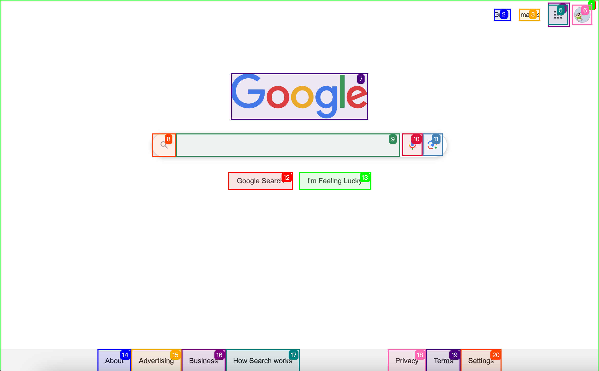

By extracting web executable elements and combining them with visual models for browser automation operations, significantly improving usability and execution success rates.


## Technical Principles

Mark executable elements in the webpage, such as clickable, input-enabled elements and those with event listeners, and assign element IDs to each executable element




Extract text labels and executable element tagNames and attributes, build pseudo HTML for model recognition using text + visual approach

```html
[0]:<body></body>
[1]:<div></div>
[2]:<a aria-label="Gmail ">Gmail</a>
[3]:<a aria-label="Search for Images ">Images</a>
[4]:<div id="gbwa"></div>
[5]:<a role="button" tabindex="0" aria-label="Google apps" aria-expanded="false"></a>
[6]:<a role="button" tabindex="0" aria-label="Google Account: Luozhuowei   (zhuowei@fellou.ai)" aria-expanded="false"></a>
[7]:</img>
[8]:<div></div>
[9]:<textarea id="APjFqb" title="Search" name="q" role="combobox" aria-label="Search" aria-expanded="false"></textarea>
[10]:<div role="button" tabindex="0" aria-label="Search by voice"></div>
[11]:<div role="button" tabindex="0" aria-label="Search by image"></div>
[12]:<input type="submit" name="btnK" role="button" tabindex="0" aria-label="Google Search" value="Google Search"></input>
[13]:<input type="submit" name="btnI" aria-label="I'm Feeling Lucky" value="I'm Feeling Lucky"></input>
[14]:<a>About</a>
[15]:<a>Advertising</a>
[16]:<a>Business</a>
[17]:<a>How Search works</a>
[18]:<a>Privacy</a>
[19]:<a>Terms</a>
[20]:<div role="button" tabindex="0" aria-expanded="false">Settings</div>
```
