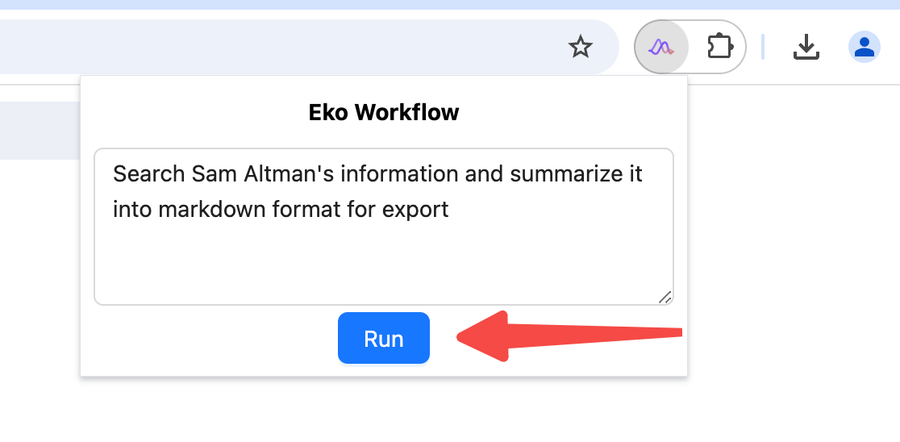

Let's create an Eko workflow together in a browser extension to automate the task that `Search Sam Altman's information and summarize it into markdown format for export`. 

> With this plugin, you no longer need to manually open multiple web pages; instead, you can run everything with a single click.

<video controls>
  <source src="/docs/quickstart.mov" />
</video>

## Load extension

- Download latest stable version of [FellouAI/eko-browser-extension-template](https://github.com/FellouAI/eko-browser-extension-template/releases). Unzip the ZIP file to a suitable location, and you should see a `dist` folder.
- Open the [Chrome browser](https://www.google.com/chrome/) and navigate to `chrome://extensions/`.
- Turn on `Developer mode` (toggle switch in the top right corner).
- Click `Load unpacked` button (the blue text in the top-left corner) and select the `dist` folder in the first step.
- For **Chinese** users: If it's inconvenient to obtain an API key from the OpenAI or Claude platform, consider using mirror sites or services (such as [ZetaTechs API](https://api.zetatechs.com/)), and then replace the *Base URL* and *API key* with the corresponding values.

<video controls>
  <source src="/docs/load_extension.mov" />
</video>

## Configure LLM model API Key

- Click the `Details` button on the `eko agent` card.
- Scroll down to find the `Extension options` section.
- Open it and enter your LLM model API Key.

<video controls>
  <source src="/docs/config_llm.mov" />
</video>

## Let's run it!
Pin the current extension in the browser's top-right extensions menu, click the extension to open the popup, input task prompt, and click the RUN button to execute.

Run your workflow by clicking the RUN button in the extension popup.
<video controls>
  <source src="/docs/quickstart.mov" />
</video>

## Next Steps

Now that you have run the first workflow, you can:

- Understand the [Installation](/docs/first-steps/installation) of Eko in different environments
- Learn about Eko's [Configuration](/docs/first-steps/configuration) in different environments
- Learn more core concepts of Eko: [Dive deep into Eko](/docs/first-steps/dive-deep)
