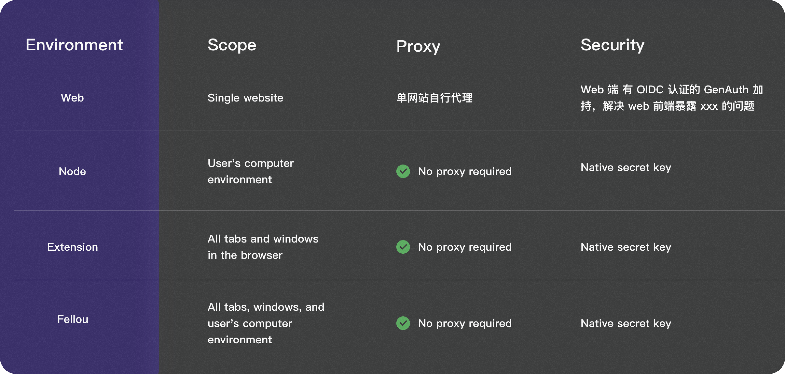

## What is Eko?
Eko is a revolutionary framework designed to empower developers and users alike to program their browser and operating system using natural language. With seamless integration of browser APIs, OS-level capabilities, and cutting-edge AI tools like Claude 3.5, Eko redefines how we interact with technology, making it intuitive, powerful, and accessible.

# Framework Comparison

| Feature                              | Eko   | Langchain  | Browser-use  | Dify.ai  | Coze   |
|--------------------------------------|-------|------------|--------------|----------|--------|
| **Supported Platform**               | **All platform**  | Server side  | Browser  | Web  | Web  |
| **One sentence to multi-step workflow** | ✅    | ❌          | ✅            | ❌        | ❌      |
| **Intervenability**                  | ✅    | ✅          | ❌            | ❌        | ❌      | 
| **Development Efficiency**           | **High**  | Low      | Middle        | Middle    | Low    | 
| **Task Complexity**           | High  | High      | Low        | Middle    | Middle    | Middle       |
| **Open-source**                      | ✅    | ✅          | ✅            | ✅        | ❌      |
| **Access to private web resources** | ✅ **(Coming soon)** | ❌          | ❌            | ❌        | ❌      |

## Eko's Abilities
- **Browser Use**: Collect the latest NASDAQ data on Yahoo Finance, including price changes, market capitalization, trading volume of major stocks, analyze the data and generate visualization reports.
<video controls>
  <source src="/docs/web_use.mp4" />
</video>

- **Computer Use**: Clean up all files in current directory larger than 1MB.
<video controls>
  <source src="/docs/computer_use.mp4" />
</video>

Learn more: [Eko Demos](https://github.com/FellouAI/eko-demos).

## Supported environment

Learn more:
- [Browser Extension Environment](/docs/browseruse/browser-extension)
- [Web Environment](/docs/browseruse/browser-web)
- [Node.js Environment](/docs/computeruse/computer-node)
- [Next-Gen AI Browser Fellou Environment](/docs/computeruse/computer-fellou)

## Getting started
- [Quickstart](quickstart)
- [Installation](installation)
- [Configuration](configuration)
- [Diving deep into Eko](dive-deep)

## Support and Community
- [GitHub Issues](https://github.com/FellouAI/eko/issues) for bug reports and feature requests
- [Documentation](https://eko.fellou.ai/docs) for detailed guides and API reference
