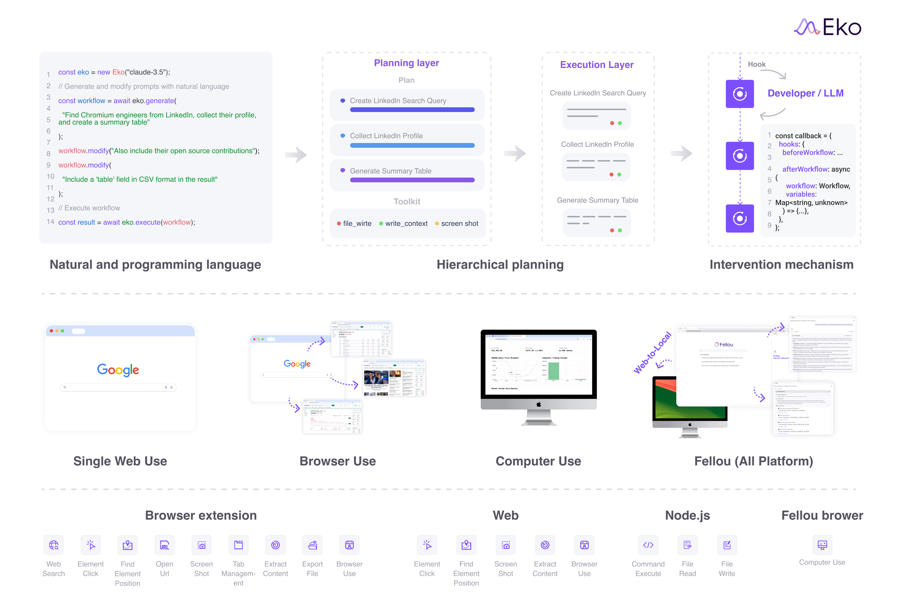

## What is Eko?
Eko (pronounced like 'echo') is a framework designed for building production-ready agentic workflows. It offers an efficient, cross-platform solution for developing complex workflows that allow developers to combine natural and programming languages. For production safety, Eko provides real-time monitoring and intervention capabilities.

# Framework Comparison

| Feature                                 | Eko                 | Langchain   | Browser-use | Dify.ai | Coze |
| --------------------------------------- | ------------------- | ----------- | ----------- | ------- | ---- |
| **Supported Platform**                  | **All platform**    | Server side | Browser     | Web     | Web  |
| **One sentence to multi-step workflow** | ✅                   | ❌           | ✅           | ❌       | ❌    |
| **Intervenability**                     | ✅                   | ✅           | ❌           | ❌       | ❌    |
| **Development Efficiency**              | **High**            | Low         | Middle      | Middle  | Low  |
| **Open-source**                         | ✅                   | ✅           | ✅           | ✅       | ❌    |
| **Access to private web resources**     | ✅ **(Coming soon)** | ❌           | ❌           | ❌       | ❌    |

## Eko's Abilities
- **Browser Use**

> Collect the latest NASDAQ data on Yahoo Finance, including price changes, market capitalization, trading volume of major stocks, analyze the data and generate visualization reports.

<video controls>
  <source src="/demo_stock_analysis.mp4" />
</video>

> Based on the README of FellouAI/eko on github, search for competitors, highlight the key contributions of Eko, write a blog post advertising Eko, and post it on Write.as.

<video controls>
  <source src="/demo_SEO.mp4" />
</video>

> Current login page automation test: 
1. Correct account and password are: admin / 666666 
2. Please randomly combine usernames and passwords for testing to verify if login validation works properly, such as: username cannot be empty, password cannot be empty, incorrect username, incorrect password 
3. Finally, try to login with the correct account and password to verify if login is successful 
4. Generate test report and export

<video controls>
  <source src="/demo_web_test.mp4" />
</video>

- **Computer Use**:

> Clean up all files in the current directory larger than 1MB.

<video controls>
  <source src="/demo_clean_computer.mp4" />
</video>

Learn more: [Eko Demos](https://github.com/FellouAI/eko-demos).

## Supported environment

Learn more:
- [Browser Extension Environment](/browseruse/browser-extension)
- [Web Environment](/browseruse/browser-web)
- [Node.js Environment](/computeruse/computer-node)
- [Next-Gen AI Browser Fellou Environment](/computeruse/computer-fellou)

## Getting started
- [Quickstart](quickstart)
- [Installation](installation)
- [Configuration](configuration)
- [Diving deep into Eko](dive-deep)

## Support and Community
- [GitHub Issues](https://github.com/FellouAI/eko/issues) for bug reports and feature requests
- [Documentation](https://eko.fellou.ai/docs) for detailed guides and API reference
