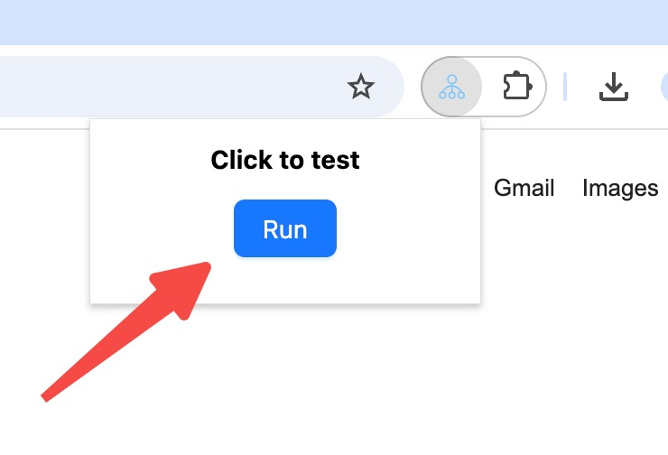

This guide teaches you how to create an eko workflow in a browser extension to accomplish complex tasks through browser automation.

## Initialize Project

Let's start by creating a new project and installing Eko:

```bash
# install cli (used to initialize browser extension projects)
npm install @eko-ai/eko-cli -g
# initialize project
eko-cli init browser-extension-demo

cd browser-extension-demo
# install dependencies
npm install
```

For a complete example of using Eko in a browser extension, check out our [example extension project](https://github.com/FellouAI/eko-browser-extension).

## Your First Workflow

Let's create a simple workflow to search for Sam Altman's information and export it to markdown.

<video controls>
  <source src="/docs/run_workflow.mov" />
</video>


Create ts files in the background directory:

```typescript
// src/background/first_workflow.ts
import { Eko } from "@eko-ai/eko";
import { EkoConfig } from "@eko-ai/eko/types";
import { tools, getLLMConfig } from "@eko-ai/eko/extension";

export async function main() {
  // Load LLM model configuration 
  // the current browser plugin project provides a page for configuring LLM parameters
  let config = await getLLMConfig();

  // Initialize eko
  let eko = new Eko(config as EkoConfig);

  // Generate a workflow from natural language description
  const workflow = await eko.generateWorkflow(`
    Search Sam Altman's information and summarize it into markdown format for export
  `);

  // Execute the workflow
  await eko.execute(workflow);
}
```

Project initialization is complete, let's run it!

## Run Project

### Build

Build the project into browser-loadable extension code:

```
$ npm run build:dev
```

### Load Extension

- Open Chrome browser extensions page `chrome://extensions/`
- Enable Developer Mode
- Load unpacked extension, select the dist directory of current project

<video controls>
  <source src="/docs/load_extension.mov" />
</video>

### Configure LLM Model Api Key

Click on the current eko extension details, find Extension Options in the details page, then click to configure LLM model Api Key.

<video controls>
  <source src="/docs/config_llm.mov" />
</video>

### Run

Pin the current extension in the browser's top-right extensions menu, click the extension to open the popup, and click the RUN button to execute.



## Next Steps

Now that you have run the first workflow, you can:

- Understand the [Installation](/docs/getting-started/installation) of Eko in different environments
- Learn about Eko's [Configuration](/docs/getting-started/configuration) in different environments
- Learn more core concepts of eko: [Dive deep into Eko](/docs/getting-started/dive-deep)
